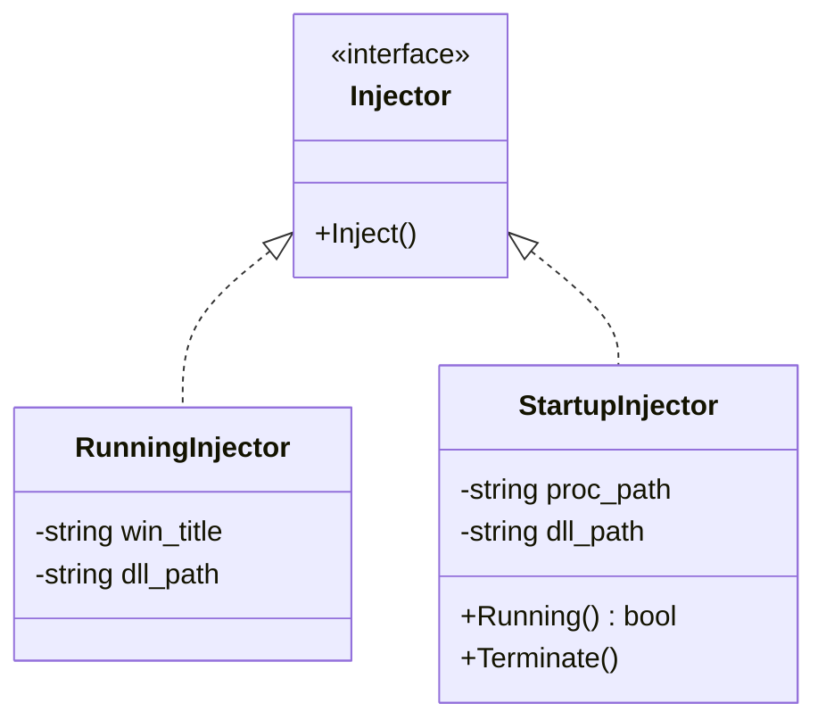

# *Windows* Dynamic-Link Library Injector


[](https://www.microsoft.com/en-ie/windows)


## 翻译

- [English](https://github.com/Zhuagenborn/Windows-DLL-Injector/blob/main/README.md)
- [简体中文](https://github.com/Zhuagenborn/Windows-DLL-Injector/blob/main/README-CN.md)

## 简介

***Dll-Injector***是一款使用*C++20*编写的***Windows*动态链接库**注入工具。它可以通过搜索窗口标题将`.dll`文件注入至运行中的进程，或在创建新进程时进行注入。

## 开始

**警告**

> 项目不包含工程配置文件，源代码可以使用*Visual Studio 2022*手动构建。

### 前置条件

该项目需要编译为***Windows* 32位**版本。

## 使用

```console
Dll-Injector [-f <proc-path> | <win-title>] <dll-path>
```

**将动态链接库注入至运行中的进程**

对运行中的进程进行注入时，需要指定目标进程的*窗口标题*和`.dll`文件的*路径*。如果`dll-path`参数是一个相对路径，则其必须相对于`Dll-Injector.exe`文件。

```console
Dll-Injector <win-title> <dll-path>
```

例如，将`dllmain_msg.dll`（假定其位于*Dll-Injector*目录）注入*Windows Calculator*进程：

```console
Dll-Injector Calculator dllmain_msg.dll
```

**创建新进程时进行注入**

若需要在创建新进程时进行注入，必须先设置`-f`选项，然后再指定目标进程和`.dll`文件的*路径*。如果`dll-path`参数是一个相对路径，则其必须相对于进程文件。

```console
Dll-Injector -f <proc-path> <dll-path>
```

## 文档

代码注释采用[*Doxygen*](https://www.doxygen.nl)规范。

### 类图



## 许可证

使用*MIT*协议，请参考`LICENSE`文件。