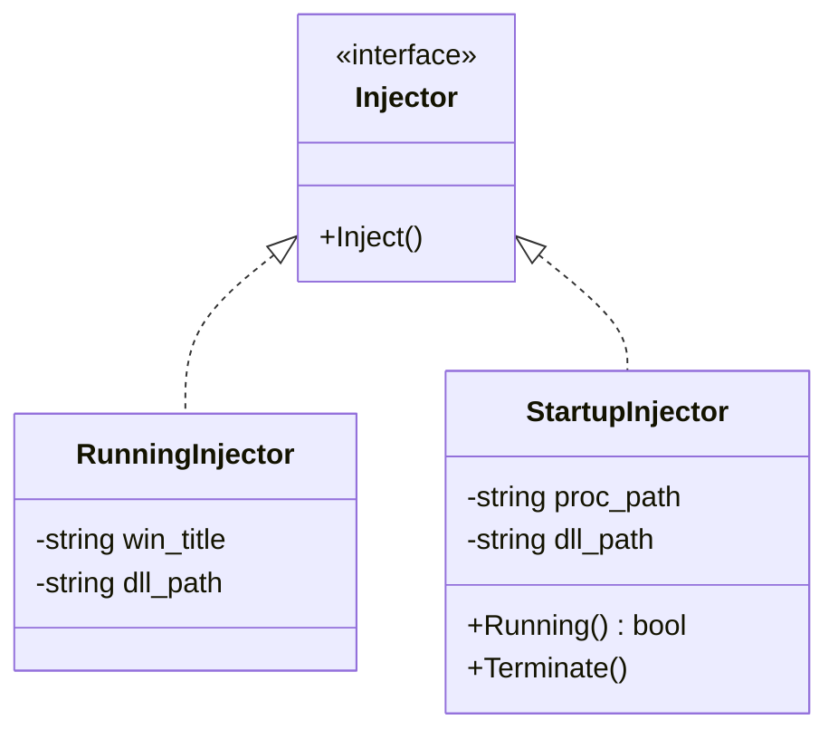

# *Windows* Dynamic-Link Library Injector


[](https://www.microsoft.com/en-ie/windows)


## Languages

- [English](https://github.com/Zhuagenborn/Windows-DLL-Injector/blob/main/README.md)
- [简体中文](https://github.com/Zhuagenborn/Windows-DLL-Injector/blob/main/README-CN.md)

## Introduction

***Dll-Injector*** is a ***Windows* dynamic-link library** injection tool written in *C++20*. It can inject a `.dll` file into a running process by searching its window title or create a new process with an injection.

## Getting Started

**Warning**

> The project does not contain building configuration files, the source code can be built manually with *Visual Studio 2022*.

### Prerequisites

The project need to configure on/for ***Windows* 32-bit**.

## Usage

```console
Dll-Injector [-f <proc-path> | <win-title>] <dll-path>
```

**Inject a Dynamic-Link Library Into a Running Process**

To inject a `.dll` file into a running process, you need to specify the *window title* of the target process and the *path* of the `.dll` file. If `dll-path` is a relative path, it must be relative to the `Dll-Injector.exe`.

```console
Dll-Injector <win-title> <dll-path>
```

For example, inject the `dllmain_msg.dll` (assume it is in the same directory as *Dll-Injector*) into *Windows Calculator*:

```console
Dll-Injector Calculator dllmain_msg.dll
```

**Create a New Process With an Injection**

To create a new process with an injection, you must enable the `-f` option firstly and then specify the *paths* of the target process and the `.dll` file. If `dll-path` is a relative path, it must be relative to the process file.

```console
Dll-Injector -f <proc-path> <dll-path>
```

## Documents

Code comments follow [*Doxygen*](https://www.doxygen.nl) specification.

### Class Diagram



## License

Distributed under the *MIT License*. See `LICENSE` for more information.